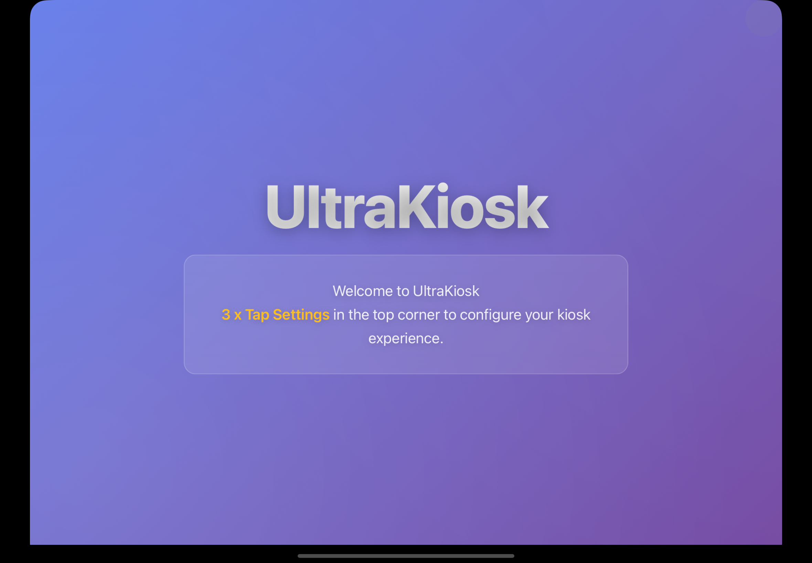
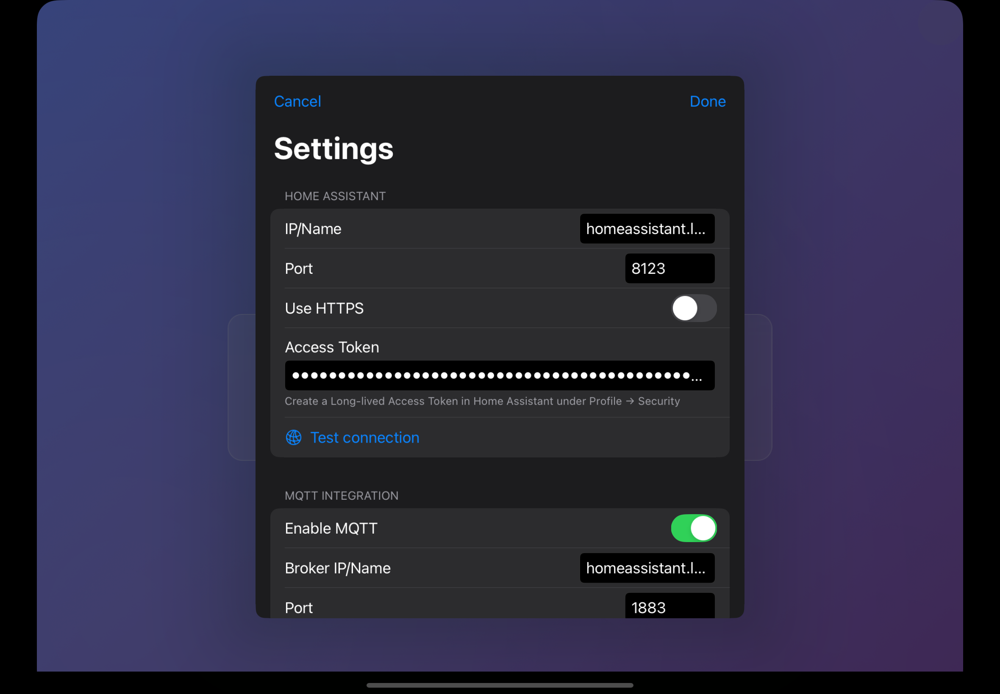
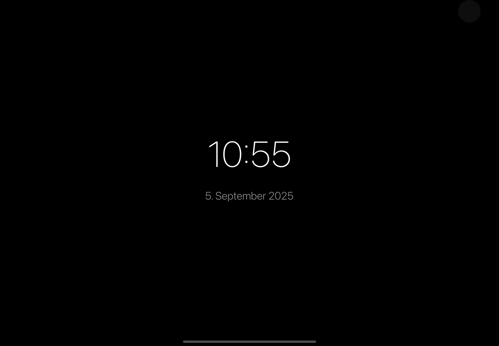

# UltraKiosk

[](https://github.com/mirkosertic/UltraKiosk/actions/workflows/build.yaml)

UltraKiosk is a lightweight iOS app that displays Home Assistant in full‑screen kiosk mode. It can also act as a voice satellite. A common use case is a wall‑mounted iPad as a smart display.

## Features
- Full‑screen kiosk-mode display of Home Assistant dashboards (works best with HACS "Kioskmode")
- Screensaver after inactivity
- Wake the display via face detection using the device camera
- Always‑on voice satellite for Home Assistant Voice Pipeline

## Screenshots

*Start screen / Kiosk WebView*


*Settings*


*Screensaver*



## Installation
- Open the project in Xcode (`UltraKiosk.xcodeproj`).
- Select a target device (iPad/iPhone).
- Build and install the app on the device.

Requirements:
- Xcode (latest version)
- iOS device with camera and network access
- A reachable Home Assistant instance (local or remote)

## Quick Start
1. Install and launch the app.
2. Set the Kiosk URL and other options in Settings.
3. The dashboard loads in full screen; a screensaver starts after inactivity.
4. The display wakes via local face detection.

Example Kiosk URL:
```
http://homeassistant.local:8123/anzeige-flur/0?kiosk=true
```

Note: Do not commit secrets (tokens, passwords) to the README or source code. Use secure storage (e.g., Keychain) or environment/config files excluded from version control.

## Configuration
Configuration data is available by tapping three times in the top right corner of the screen. You should also see a small semi-transparent circle there. A configuration dialog will appear, offering the following configuration sections:

### Home Assistant
- IP/Name
- Port
- Use HTTPS
- Access Token

### MQTT Integration
- Broker IP/Name
- Port
- Use TLS/SSL
- Username (optional)
- Password (optional)
- Topic Prefix
- Batterie Update Interval

### ScreenSaver
- Inactivity timeout
- Screen brightness (dimmed)
- Screen brightness (normal)
- Face detection interval

### Voice Assistant
- Enable voice activation
- Timeout
- Noise suppression level
- Auto gain (dBFS)
- Volume multiplier

### Kiosk mode
- Kiosk URL (optional)

## Privacy & Permissions
- **Camera**: Used for face detection to wake the display.
- **Microphone**: Used for the voice satellite feature (always‑listening when enabled).
- No biometric data is stored. Face detection is used locally only to activate the display.

## Contributing
Contributions are welcome! Please:
- Open an issue for bugs or feature requests.
- Submit pull requests with clear descriptions and small, reviewable changes.

## License
This project is open source. See `LICENSE` (if present) or repository notes for details.

## Roadmap
- Kiosk refinements and stability improvements
- Extended in‑app settings
 